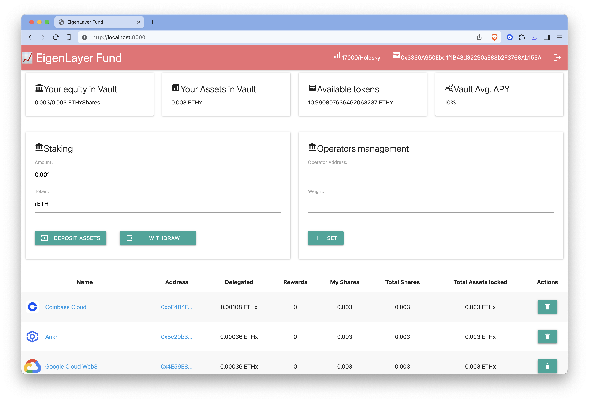
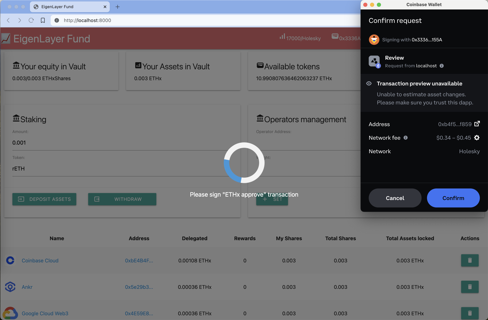
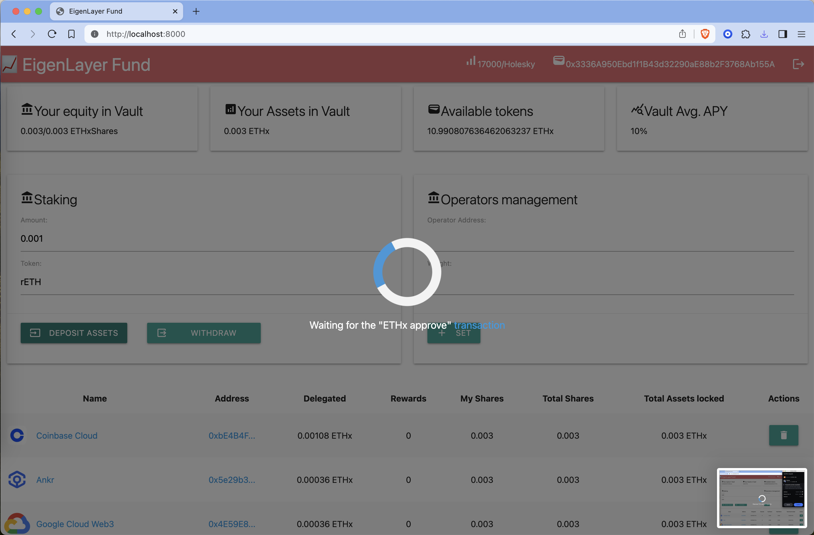
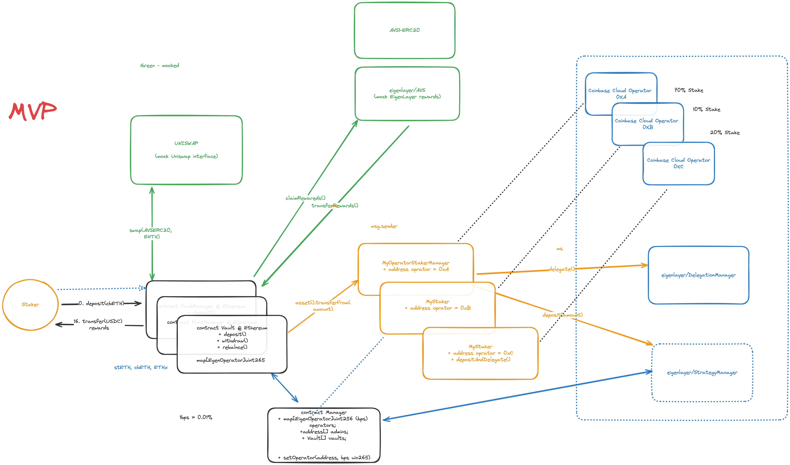
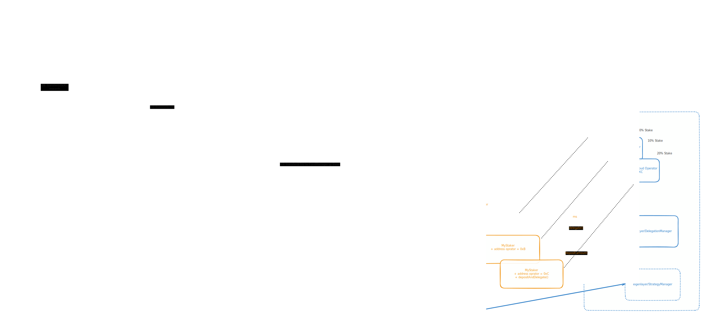

# EigenLayer FundManager

- On-chain Managed Fund for the EigenLayer delegators and liquid staked ETH restaking. 
- On-chain billing and customer rewards management. 
- Auto-compounding and automatic rewards withdrawal.


values we can offer
- 👍 stacking to EigenPod, and then delegate to Coinbase Cloud Operators
- 👍 restacking of liquid-staked ETH to Coinbase Cloud Operators
- 👍 automatic rewards withdrawal in the token of customer choice (USDC)
- 👍 automatic rewards compounding (reinvesting)
- 👍 save on gas fees
- 👍 ERC4626 Vault compatible with beffy.com, yearn.fi, and other yielding pools aggregators 


[My Medium Post with Findings about EigenLayer](https://medium.com/@dzianisv/blockchain-dev-eigenlayer-erc4626-and-magic-of-auto-compounding-e3016e69dfa4)

## Demo 

[Live Demo @ Holesky](https://eigenlayerfund.netlify.com)





## Contract System Desgin 


## Multichain System Design



# Technologies Used
- MaterializeCSS
- Ethers.js
- Foundry
- OpenZeppelin

## Dev

### Environment


1. Install foundry

```bash
curl -L https://foundry.paradigm.xyz | bash
```

2. Pull repo and submodules `git submodule update --init --recursive`

3. Go to contracts and run `cd contracts; forge install; forge bulid` or `forge test`


### How to deploy contract

1. `cd contracts`
2. Copy `.env.example` to `.env` and set values
3. Run deployment scripts
```bash
./bin/run-script --verify script/ExchangeDeploy.sol
./bin/run-script --verify script/VaultDeploy.sol
```
4. Add liqudity to exchange. It transfer RewardsTokens and ETHx to the Exchange liqudity pool. This pool will be used to swap rewards tokens into the liqudity tokens for auto-reinvesting...
```bash
./bin/run-script -vvv  ./script/ExchangeAddLiqudity.sol
```

5. Harvest rewards -> autocompound
```bash
./bin/run-script ./script/VaultHarvest.sol
```


### Web
1. `cd webui && python3 -m http.server`
2. Open [localhost:8000](http://localhost:8000)

# Useful information

- What is the EigenLayer Pod? According to the context provided, an EigenPod is a smart contract managed by users, designed to facilitate the EigenLayer protocol in monitoring and managing balance and withdrawal statuses. Here are some key points about EigenPods:

    - You can repoint any number of validators to a single EigenPod 
    - An Ethereum address can only deploy a single EigenPod
    - The address that deploys an EigenPod becomes the owner of the contract and gains permission for restaking and withdrawal operations
    - Ownership of an EigenPod cannot be transferred 
    - To create an EigenPod, you need to:
        - Open the EigenLayer App at https://app.eigenlayer.xyz/ and connect your Web3 wallet, making sure you are connected to Ethereum mainnet 
        - If successful, you should receive a confirmation and the EigenPod Address will be displayed
So in summary, an EigenPod is a user-controlled smart contract that acts as the interface between a user's validators and the EigenLayer protocol, allowing the user to manage their staking balance and withdrawals within the EigenLayer ecosystem [3]. It is a key component for participating in EigenLayer's restaking and delegation features.
- How to get testnet ETH and stETH? 
    - https://holesky-faucet.pk910.de/ - testnet ETH has to be mined in the browser
    - Or https://www.holeskyfaucet.io/ - requires yubikey for associate an address with identity
    - Or https://faucet.quicknode.com/ethereum/holesky requires 0.001 ETH on the eth2 mainnet
    - Then swap holETH to stETH on https://stake-holesky.testnet.fi/
